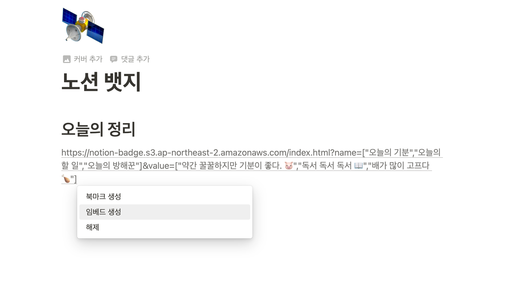

# notion-badge

노션에 임베딩 할 수 있는 뱃지를 만들자.

```
yarn
yarn run:dev # localhost:8000 으로 시작하기
yarn build # build
yarn lint:fix # lint 고치기
```

# 사용법

1. [링크](https://notion-badge.s3.ap-northeast-2.amazonaws.com/index.html)로 접속해서 뱃지를 만듭니다. 
  * 뱃지는 최대 3개까지 만들 수 있습니다.
2. 만든 뱃지의 URL을 복사합니다.
3. Notion에 복사해서 임베딩 합니다.
  
4. 이쁘게 보여줍니다.
  
